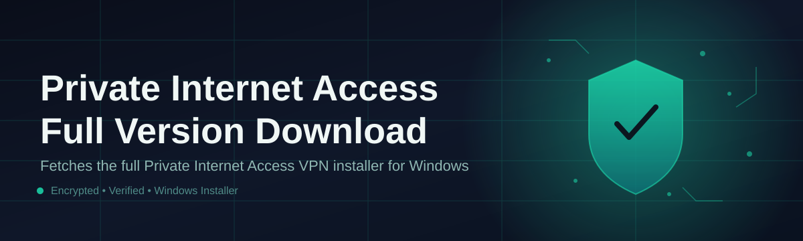

# private-internet-access-manager 🔐🛡️

  

*A single, focused control panel for managing your Private Internet Access configuration end-to-end.*

  

---

## 🧭 What This Is NOT

> [!IMPORTANT]
> This is **not** a modified client, a patched binary, or a workaround for licensing systems. It does not alter, unlock, or repackage any vendor software. It contains no license generators and no third-party redistribution of proprietary installers.

`private-internet-access-manager` is not a VPN service. It does not tunnel your traffic, does not proxy connections, and does not replace your existing network stack. There is no background daemon phoning home, no telemetry pipeline, and no bundled adware.

What it **is**: a lightweight Windows companion application that organizes the process of locating, verifying, and launching your Private Internet Access setup. Think of it as a well-labeled toolbox sitting next to your workbench — it doesn't build the furniture for you, but it makes sure every tool is where you expect it, every time.

## 🗺️ Overview

Private Internet Access Full Version Download is one of the more frequently searched phrases among users trying to consolidate a scattered setup process into something predictable. Most people encounter the same friction: mismatched installer versions, unclear changelogs, and no single reference point for tracking what's current. `private-internet-access-manager` exists to remove that friction — it acts as an organizing layer around your PIA setup workflow, giving you a clean interface for tracking versions, verifying file integrity, and keeping your local environment tidy.

This project was built for people who value repeatability. Whether you're a system administrator standardizing setups across a small fleet of Windows machines, or an individual user who wants a single dashboard instead of a folder full of loose executables, the manager gives you structure. It doesn't reinvent networking — it respects the boundary between "managing configuration" and "handling traffic," staying firmly in the former lane.

The target audience is broad but specific: privacy-conscious Windows users, IT support staff who field the same setup questions weekly, and anyone who prefers a documented, versioned, auditable approach to software management over ad-hoc downloads from scattered sources. If you've ever lost track of which installer you last verified, this tool is for you.

---

## ⚡ Capabilities

- **Version ledger** — Maintains a local, human-readable log of which build you last configured, so you're never guessing what's installed.

- **Integrity verification** — Runs checksum comparisons against known-good hashes before anything is marked as verified, catching corrupted or tampered files early.

- **Guided setup flow** — Walks through configuration steps in order, with inline explanations instead of silent assumptions.

- **Zero-footprint mode** — Runs as a portable executable; nothing is written to system folders unless you explicitly choose to install.

- **Snapshot restore** — Save a known-good configuration state and roll back to it in one click if something drifts.

- **Offline-first design** — Once downloaded, the core interface functions without a persistent internet connection.

- **Audit-friendly logs** — Every action is timestamped and exportable, useful for teams that need a paper trail.

- **Theming and accessibility** — Light, dark, and high-contrast modes ship out of the box.

> [!TIP]
> Enable **Snapshot restore** before making any configuration change. It costs nothing and saves you from re-doing setup from scratch.

---

## 🚀 How to Get Started

1. **Visit the landing page** using the download button above or below — this is the only distribution point for this project.

2. **Download the standalone executable** — no installer wizard, no bundled third-party offers.

3. **Run it directly** — double-click to launch; Windows SmartScreen may prompt on first run for unsigned or newly-published binaries, which is expected behavior for small open-source tools.

4. **Follow the guided setup flow** inside the app to complete your configuration and verify integrity.

> [!NOTE]
> No terminal commands, no package managers, no dependency installers. If a setup step asks you to run something outside the app itself, that step did not come from this project.

---

## 🖥️ System Requirements

| Requirement | Detail |
|---|---|
| OS | Windows 10 (64-bit) or Windows 11 |
| RAM | 2 GB minimum, 4 GB recommended |
| Disk space | 150 MB free |
| Dependencies | None — fully standalone |
| .NET / runtime | Not required |
| Admin rights | Only needed for system-wide install mode |

  

---

## ⚙️ How It Works

The manager operates in a simple, linear flow designed to minimize surprises:

1. **Launch** — the app opens to a dashboard summarizing your current state.

2. **Locate** — it checks for an existing PIA-related configuration on your machine.

3. **Verify** — checksums are computed and compared against a reference table.

4. **Configure** — the guided flow walks you through remaining setup steps.

5. **Confirm** — a final summary screen shows what changed and what didn't.

> [!WARNING]
> If the **Verify** step reports a mismatch, do not proceed. Re-download from the landing page rather than forcing configuration on an unverified file.

---

## 🧩 Troubleshooting

<strong>The app won't launch after download — what do I check first?</strong>

Confirm Windows SmartScreen isn't silently blocking it. Right-click the executable, choose Properties, and check for an "Unblock" checkbox at the bottom of the General tab.

<strong>Verification keeps failing on the same file.</strong>

This usually indicates an interrupted download. Clear the file, re-download from the landing page, and re-run verification before touching configuration.

<strong>Can I run this on Windows 7 or 8?</strong>

No. Only Windows 10 (64-bit) and Windows 11 are supported and tested going into 2026.

<strong>Does this modify my existing PIA installation?</strong>

No. It reads and organizes configuration metadata; it does not alter vendor binaries.

<strong>Where are logs stored?</strong>

In a local `logs` folder next to the executable in portable mode, or under your user profile in install mode.

<strong>I lost my snapshot — is it recoverable?</strong>

Snapshots are stored locally and are not recoverable if manually deleted. Regular export to an external drive is recommended.

---

## 🎨 UI / UX Details

- **Keyboard shortcuts**:

  - `Ctrl + S` — Save current snapshot

  - `Ctrl + R` — Run verification

  - `Ctrl + ,` — Open settings

  - `F1` — Open in-app help panel

- **Themes** — Light, Dark, High-Contrast, and an Auto mode that follows your Windows theme setting.

- **Settings persistence** — All preferences are stored locally in a plain-text config file, editable outside the app if needed.

> [!TIP]
> High-Contrast mode is not just an accessibility nicety — it also makes verification diffs far easier to read at a glance.

---

## 🤝 Contributing & Community

This project grows through community input — issue reports, documentation fixes, and small pull requests are all welcome.

- Open an issue for bugs, unclear docs, or feature requests.

- Fork the repository, make focused changes, and submit a pull request with a clear description.

- Please avoid submitting anything that touches licensing circumvention, redistribution of proprietary binaries, or unrelated bundled software — such contributions will be closed without review.

> [!NOTE]
> Discussions and feature proposals are best opened as GitHub Issues first, so maintainers and other users can weigh in before code is written.

---

## 📄 License

Released under the [MIT License](LICENSE), 2026. Use it, fork it, adapt it — attribution appreciated but not required beyond the license terms.

---

## ⚖️ Disclaimer

This project is an independent, community-built utility and is not affiliated with, endorsed by, or officially connected to Private Internet Access or its parent company. All product names, logos, and trademarks referenced are the property of their respective owners. This tool is provided "as is," without warranty of any kind, for organizing and verifying your own legitimately obtained software configurations.

